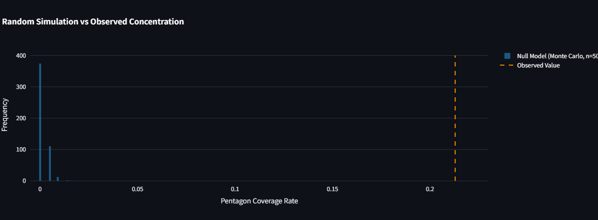
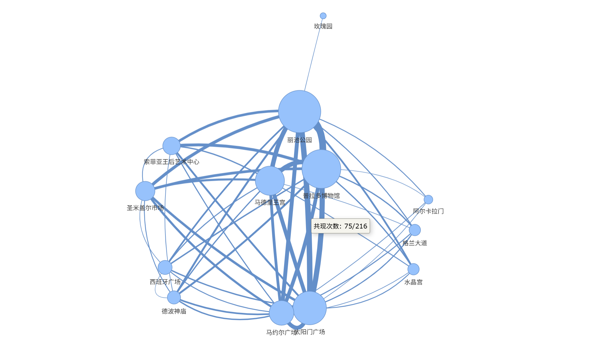
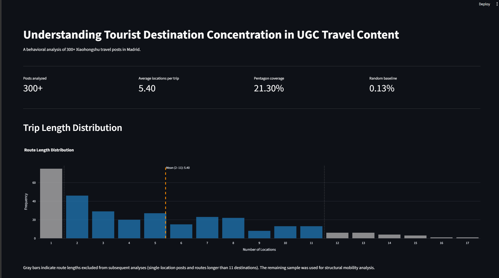

# Understand Tourist Destination Concentration in UGC Travel Content

## Project Overview

This project analyzes tourist destination selection patterns in Madrid using Xiaohongshu (Red) travel-related user-generated content.

The goal is to examine whether tourist attention is concentrated around a small set of destinations and to what extent these patterns deviate from random behavior.

Using 300+ scraped posts (**216 after filtering**), the project constructs destination co-occurrence “travel routes” and identifies a recurring five-location structure referred to as the **Tourist Pentagon**.

The results reveal a highly concentrated and strongly non-random pattern of destination co-visitation.

---

## Motivation

This project was inspired by my personal experience as an exchange student in Madrid.

During my transition from visitor to temporary resident, I noticed a clear mismatch between tourist behavior and the spatial diversity of the city. Tourists tended to cluster heavily around a small set of iconic attractions, while nearby neighborhoods—often equally interesting—remained largely under-visited.

This observation motivated the following research question:

> **How are tourist destinations structured in Madrid-related user-generated travel content?**

---

## Dataset

**Source:** Xiaohongshu travel-related posts

**Search tags:**
- 马德里攻略
- 马德里旅行攻略
- 马德里旅行
- 马德里旅游

**Data summary:**
- Raw posts: 300+
- Filtered dataset: 216 routes
- Unit of analysis: unordered destination sets per post

Each post is transformed into a destination set, where route order is not considered.

Implemented in: `data/post_dataset.py`

---

## Methodology

### Data Preparation

- Destination extraction using **LLM-based entity extraction**
- Prompt refinement and manual validation for extraction quality
- Route construction from extracted destination sets
- Duplicate removal based on post-level identifiers (`crawler/eliminate_duplication.py`)

Implemented in:
`data/extracted_locations.py`

---

### Pattern Discovery

The average route length was approximately **5 destinations per post**, which motivated further analysis of co-occurrence patterns in user travel routes.

---

### Data Filtering

Route length distribution analysis revealed a **long-tailed pattern**, where a large number of posts contain only one destination.

This suggests potential noise from:
- single-location recommendation posts
- promotional or list-style content

To improve data quality, a filtering rule was applied:

```text
1 < route length < 12
```

All subsequent analysis is based on this filtered dataset.

### Tourist Pentagon Discovery

A recurring five-destination structure was identified:

- Retiro Park (丽池公园)
- Puerta del Sol (太阳门广场)
- Prado Museum (普拉多博物馆)
- Royal Palace of Madrid (马德里王宫)
- Plaza Mayor (马约尔广场)

The Pentagon represents the dominant co-occurrence structure observed in Madrid tourism UGC.

Implemented in:
`analysis/01average_route_length.py`
`analysis/02top10_5_location_routes.py`

---

### Concentration Measurement

Coverage analysis was conducted to quantify Pentagon prevalence.

**Results:**
- Pentagon full coverage (5/5): **21.3%**
- At least one Pentagon destination: **97.2%**

To evaluate whether this pattern could emerge by chance, a **Monte Carlo random baseline simulation** was conducted while preserving route length distribution.

**Random baseline result:**
- Expected Pentagon full coverage: **0.13%**
- Observed coverage: **21.3%**

Observed concentration is approximately **160× higher than random expectation**.



Implemented in:
`analysis/pentagon_percentage.py`
`analysis/05random_baseline.py`

---

### Network Analysis

A destination co-occurrence network was constructed using pairwise location frequencies.

Network visualization reveals a dense core structure centered around Pentagon destinations, indicating strong co-visitation relationships among key attractions.



Implemented in:
`analysis/04network_analysis.py`

---

## Key Findings

- A recurring five-destination core (**Tourist Pentagon**) emerged from Madrid-related Xiaohongshu travel content.

- Destination concentration is strong: **97.2%** of posts include at least one Pentagon destination, while **21.3%** contain the full five-location structure.

- Observed Pentagon coverage (**21.3%**) is approximately **160× higher** than the simulated random baseline (**0.13%**), indicating a strongly non-random concentration pattern.

---

## Dashboard

An interactive dashboard was built to visualize:

- Route length distribution
- Tourist Pentagon coverage
- Random baseline comparison
- Destination co-occurrence network structure



---

## Repository Structure

```text
project/
│
├── data/
│   ├── post_dataset.py
│   └── extracted_locations.py
│
├── analysis/
│   ├── 01average_route_length.py
│   ├── 02top10_5_location_routes.py
│   ├── 04network_analysis.py
│   ├── 05random_baseline.py
│   └── pentagon_percentage.py
│
├── dashboard/
│
└── README.md
```

---

## Tech Stack

- Python
- Pandas
- Selenium
- NetworkX
- Pyvis
- Matplotlib
- Streamlit

---

## Limitations

This project is based on user-generated content and therefore has several limitations.

- Posts represent **destination mentions**, not verified travel trajectories.
- UGC may not fully reflect actual tourist mobility behavior.
- Platform recommendation mechanisms and content incentives may introduce bias.
- Some posts may be promotional or list-style rather than personal travel narratives.

---

## Conclusion

Madrid-related Xiaohongshu travel content exhibits a highly concentrated destination structure centered around a recurring five-location core.

The observed concentration substantially exceeds random expectation, suggesting that tourist destination representation in UGC follows strong shared spatial patterns rather than dispersed exploration.

---

## Future Work

Future extensions could compare destination concentration structures across multiple cities (e.g. Barcelona, Paris) to examine whether similar tourism patterns emerge in different urban contexts.